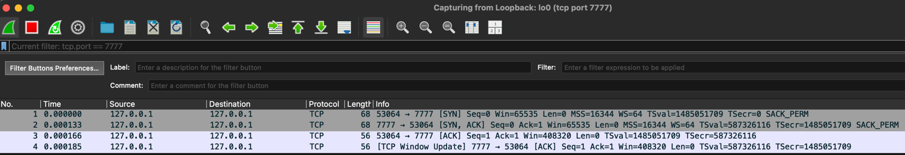
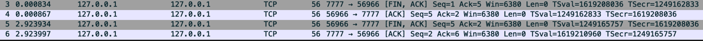
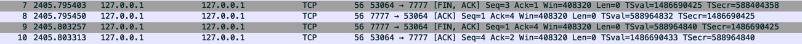
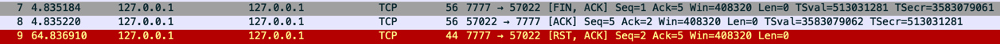

# Socket-Chat-App
The reason this project was created was to depict what goes on under the covers when we use the Java Sockets library.
The Java Sockets library abstracts the underlying technology of TCP/IP and makes it easier on the users to communicate via sockets; however,
since not much documentation appeared online on the underlying calls I decided to look into it a bit deeper.

In this project you'll find two java modules: client & server. These modules are used to open sockets between servers (or an individual server)
and establish socket communication over TCP/IP.

For the following sets of tests both client & server are running locally. The client exists on port #53064 & the server lived on port #7777.
Please note I had wire shark hooked up to listen to the server on its respective port #7777.

## Initiating connection
The initial test consisted of me launching both client & server modules at the same time. When this is done the client application 
opens up a socket connection on the opposite server's end.

Once connection was established I inspected wire shark to see what happens under the covers. It appears that the java socket
library does a TCPIP three-way handshake immediately.

Instruction `new Socket(host, port)`  initiates the following sequence of events

| Client    | Server             |
|-----------|--------------------|
| Sends SYN |                    |
|           | Responds SYN-ACK   |
| Sends ACK |                    |

## Communication
For the next test I pushed something from client to server on the client application.

`OutputStream.write()` in combination with `OutputStream.flush()` triggers the following sequence of events.

## Closing communication server side
For this test I closed the connection from the server side. And we see a
Both `Socket.close()` and `Socket.closeOutputStream()` achieve the following two scenarios.

| Client       | Server        |
|--------------|---------------|
|              | Sends FYN-ACK |
| Responds ACK |               |

Note to get the second part of this handshake we must have the client call Socket.close(). If the code is configured properly then
the following image will be the result.

## Closing communication client side
For this final test I closed the connection from the client side to the server side. And we see a
Both `Socket.close()` and `Socket.closeOutputStream()` achieve the following two scenarios.

| Client        | Server        |
|---------------|---------------|
| Sends FYN-ACK |               |
|               | Responds ACK  |
|               | Sends FYN-ACK |
| Responds ACK  |               |

Note to get the second part of this handshake we must have the server call Socket.close() on its end. If the code is configured properly then
the following image will be the result.

## Special case
Final note if either side, server or client fails formally close the connection, calling `Socket.close()`. The connection from the
sending end will eventually time out. 

The image below shows that the server decided to end the connection with the client; however, the client never sent a notification saying
"hey I'm closing my end" so the server sent an RST flag meaning it decided to close the connection.

